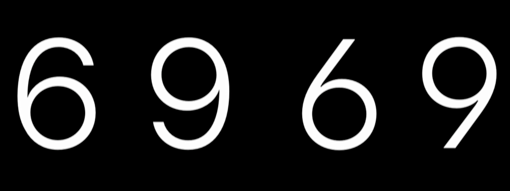
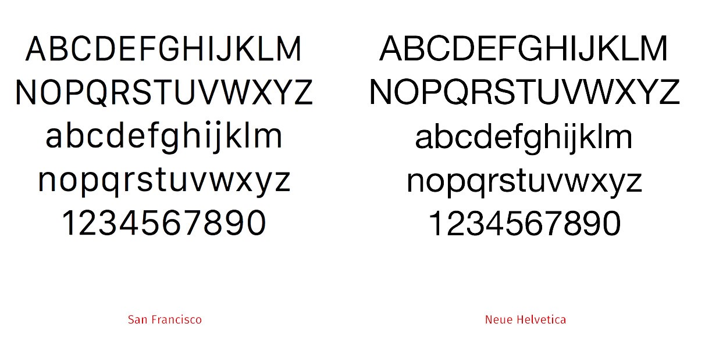

#### After being named the most ‘valuable’ company in 2021, Apple is also the world’s largest technology company. It is undeniable that each product they produce continues to be a huge success, yet, what ensures they are always so up to date with the ever-changing world of technology?

Apple is noticed to continuously produce the most modern designs/creations and their font choice reflects this. Back in the early 2000s, Apple provided two font families across their products; this included San Francisco (SF) and New York (NY) – both being legible and neutral which were ‘designed to match the visual clarity of the platform’. 

San Francisco (SF) is a sans serif font which is very common for digital screens whilst interestingly, New York (NY)is a serif font said to have been designed to complement San Francisco. They claimed to have designed these typefaces to support an extensive range of weights, sizes, styles, and languages. Despite this type being the most associated to Apple; in 2015, they ‘abandoned the world’s most beloved typeface’ (an article headlined) and moved forward with Helvetica Neue.

> "Apple is really really behind when it comes to typography" - *Erik Spiekermann*

Despite many apple enthusiast beliefs, German typographer Erik Spiekermann's belief stems from google introducing their custom font, Roboto, in 2011. This seems harsh considering apple dominates many areas in the world of technology however, other programmers such as Tal Leming also believe San Francisco holds many faults. For instance, ‘the top of the 6 loops so far down that it can be mistaken for an 8’ – despite this seemingly being a minor fault, for a company as big as Apple, these minor issues should be avoided. Apple clearly took note of this feedback as Helvetica Neue is simply an ‘upgraded’ version of the original type.

Whose fortune and success rely strongly on its commitment to design, Apple kept this transformation very low-key. Twitter was filled with dedicated fans debating whether the leaked photos of the new products included San Francisco or Helvetica Neue light. However, fans criticized the rumours of this new choice as they claimed the font was ‘too light, too thin and too small for lower-res screens’ therefore Apple subtly ditched the Neue light in favour of the meatier Helvetica Neue.

The differences between Helvetica Neue and San Francisco are minimal, even to a professional eye, but they exist. Despite the weights being similar and both fonts remaining a sans serif, San Francisco is bolder and friendlier than Helvetica Neue. San Francisco gives character allowing it to be easily read on relatively small screens. The smaller and skinnier appearance makes it space-efficient, similarly to Google’s typeface. So why did Apple switch to less-efficient sizing? 

Despite Helvetica coincidently being Steve Jobs personal favourite, it does consist of many specialists. It is believed to be an extraordinarily popular font amongst many designers; this is due to its capability of switching amongst softer company’s such as department stores but also carrying bold brands such as cars and computers. Many consider that its popularity stems from its simplicity, many types consist of over-complex designs with unnecessary embellishments making it very difficult to read/understand on smaller devices. A worthy type face is one which can easily adjust between high/low resolution and big/small visuals therefore, weighing up the technology of today, the change to Helvetica is a natural development into a modern future. Even though the font has been around since before the war began, serif is easily depicted as ‘old-fashioned’ due to serifs being illegible and too complex for the human eye and later generations.