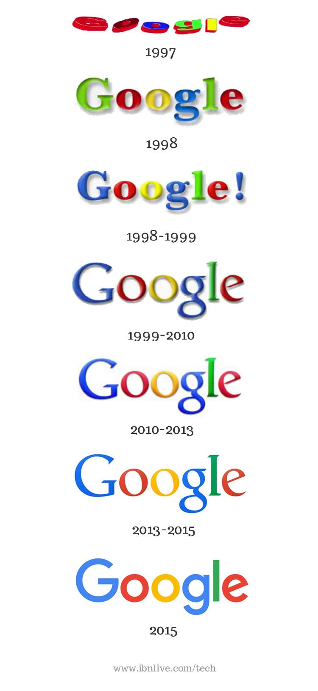

##### Being a multinational technology company – Google has always managed to stay on top of the everchanging world of technological development. Their logo has not always remained the same as they continue to develop their branding alongside the progression of type, screening and new inventions. But how?

From 1997 – 1998 the original Google logo appeared to be a heavily distorted Arial Black with a range of colours. From a modern eye, despite the font still being available and the colour choices still being featured in the logo today, it appears to be an old-fashioned type with an interesting antique look. As more and more effects and ranges of ideas have been made available to the world – Google remains to stay on top of this development.  

This antique-style logo was then changed to the no longer distorted ITC New Baskerville Bold font. This was shadowed to create a 3D effect which was the first of its kind back in 1998 and noticed to be a new revelation of font design. In 1999 the G was changed to blue which then set in stone the familiar colour scheme; yet the shadowed effect remained - with a now even more prevalent soft wide shadow to the right. They continued with Baskerville Bold and made the popular shadowed effect more noticeable and modern.

The Google logo as used from 1998 to 2015 was then designed by Ruth Kedar. In [an article from 2008](http://blogoscoped.com/archive/2008-01-14-n16.html), she comments on the design process, including the type choice:

> “Times Roman was the font of choice for the web at that time, while sans-serif fonts were the darling of the printed world. I wanted the readability of a serifed font, but looked for a typeface that had the same qualities we were looking for – subtly sophisticated, but with some humor and irreverence. The chosen typeface is based on **[Catull](https://fontsinuse.com/typefaces/7582/catull)**, an old style serif typeface. Catull borrows elements from traditional writing instruments such as the quill and the chisel with a modern twist. Search, by nature, is an activity that requires we look into the past. Therefore Catull’s historical ties seemed appropriate, as did the bridging between the old analog world and the new emerging digital era.”

The infamous shadowed effect began to reduce through the 21st century as its originality begun to slip. It was no longer a ‘never before seen’ effect and therefore put Google alongside many other brands who had adopted the idea. Therefore the 2013 logo dropped all the bevels and shadows od previous incarnations. 

As online news/media began to increase in popularity throughout the new generations, sans serif fonts became increasingly popular due to the simplicity contributing to the ease in readability. Therefore after 2015, Google jumped onto this trend as the lifelong serif font removed the serifs and became the modern logo we are left with today.

