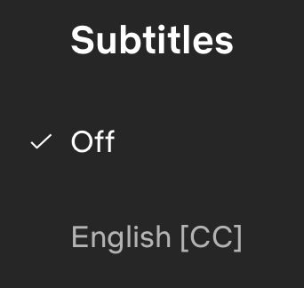

#### Have you ever noticed what font the subtitle you’re reading is? Whether that be on your 50” TV or your 4” smartphone?

Here are two of the main fonts commonly chosen for subtitles:

##### ***1. Arial***

It is almost guaranteed that you would have stumbled across this font at some point in your life – maybe even on multiple occasions in different scenarios. 

Arial is the most widespread font in the world; you may not have used it, but you are most certainly familiar with it. It is often chosen by media outlets for this exact reason. Not only this but, one of the many reasons Arial is a good choice is for the use of numbers and symbols. You might need to add symbols and numbers to your subtitle which Arial provides in a clear and simple design.

##### ***2. Roboto***

Roboto is the official subtitle font for Google and Roboto Medium (one of the variations of the original Roboto) is the default subtitle font for YouTube users. The fact that it is seen everywhere makes it easier to read for your audience.

 There is a reason for this. Roboto is one of the best fonts for subtitles (alongside Arial) due to its wide range of styles and lengths – you can you use it to your advantage based on preference and the length of your sentences.

Despite the evidence of their being some good fonts available to use alongside your motion picture - Avi Ashkenazi states ‘Subtitles were never designed. This is the missing element of TV’. This is a fact that often slips our minds – have you ever noticed this?

Subtitles are more important than we think as to ensure maximum engagement with your audience, the typography chosen must reflect this. It is not always the specific font but the size, the length, the colour and the overall readability. 

 Many different media brands provide different accessibility options – but many don’t.  

Google has lot of options, and they are the only ones that allow font change, but still none of these fonts were designed for TV. Despite Google being so diverse with the ability to choose your own format, many TV’s and outlets, like Netflix, only give you the ability to turn them off and on. 

TV is static, the subtitles are always at the same bottom area of the screen, and the distance also mostly remains the same. Of course, there are different distances people choose in their living rooms and sizes of TV, but that’s what accessibility settings are for. The TV size should immediately effect the size of the subtitles and it should be something that is adjusted as a part of setting up the TV. However, if this service is not offered, you are relying on the original design to provide you with the best experience possible. 

##### **Netflix** was asked their opinion on the important of subtitles:

> *“Subtitles and closed captions have historically been deemed a secondary asset. Even our own technical specification lists subtitles and closed captions (timed text) among several types of secondary assets that NETFLIX requires. The reality is that for millions of our members around the world, timed text files are primary assets.”*

##### Will we see a designated font designed in the future?