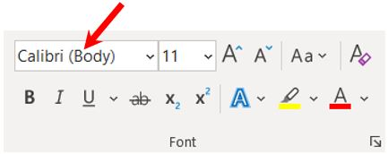
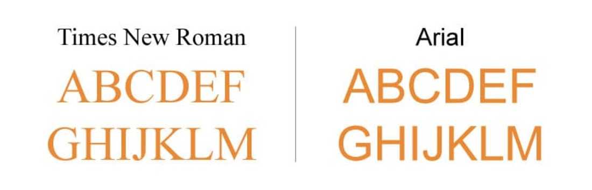
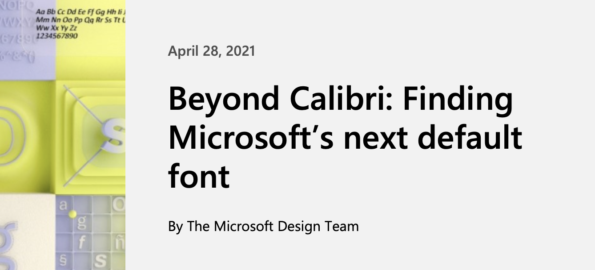
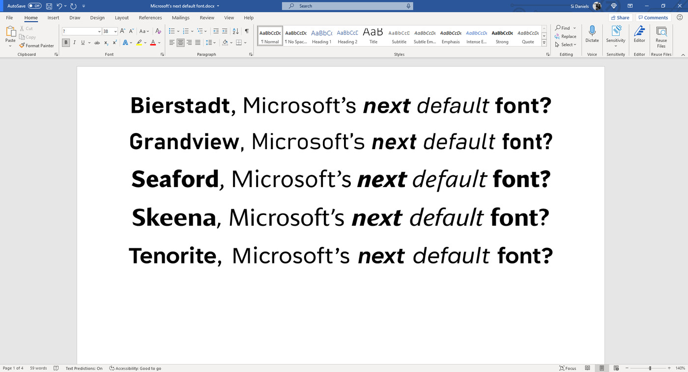

##### Calibri has been the default font for all things Microsoft since 2007, when it stepped in to replace Times New Roman across Microsoft Office. Comparing Times New Roman with Calibri, it is clear as to why they decided to 'upgrade'. Calibri is a modern sans serif typeface which features subtly rounded stems and corners that are visible at larger sizes - perfect for online platforms. The font was released in 2007 after being designed with Microsoft since 2004. In comparison to this, Times New Roman is a serif typeface - It was commissioned by the British newspaper The Times in 1931. This already holds timely values which the new 21st century font doesn't. Joe Friend, a program manager on Word for Office 2007's release, explained that the decision to switch to Calibri was caused by a desire to make the default font one optimised towards onscreen display.

> "We believed that more and more documents would never be printed but would solely be consumed on a digital device", and to achieve a "modern look"

Joe Friend's comment targets the ever-changing world of technology and mirrors the thought process behind staying aline with the modern environment. His prediction was proven to be true as the modern world has now, without a doubt, become increasingly digitalised. When opening Microsoft, you automatically get Calibri as the font for your document (unless changed) - this promoted and familiarised the new creation with all users which increased the usage. This business tactic meant that everyone was slowly being transformed to a new era of technology without noticing. 

Many popular blogs and tech pages are discussing the expected update coming soon for Microsoft as it reaches 14 years since their last font change. Headline examples include 'Goodbye, Calibri!', 'Microsofts next default font' and 'Even Calibri's creator is glad Microsoft is moving on' - all of which contain controversial opinions on the upcoming switch.

Though Microsoft has not yet announced what their new font will be, there have been many rumours around different predictions. Microsoft commissions 5 different font designers who have pitched their ideas, in hope of persuading them to choose their design. Calibri is slowly becoming less and less popular which is why Microsoft is desperate to move forward.

The new fonts are as follows; Tenorite, Bierstadt, Skeena, Seaford, and Grandview. Interestingly, all of which are sans serif with extremely modern designs - <https://www.microsoft.com/en-us/microsoft-365/blog/2021/04/28/beyond-calibri-finding-microsofts-next-default-font/> - Using this link, allows you to view the fonts and an explanation by each designer whilst also giving you the ability to download them on iCloud in order to trial them out. Which do you hope will appear as you open up your document in 2022?

