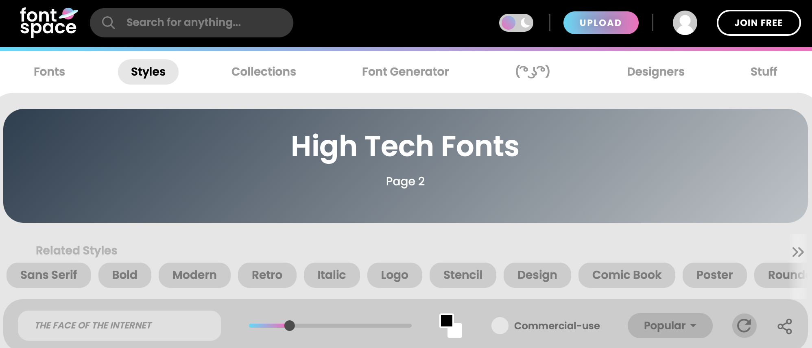
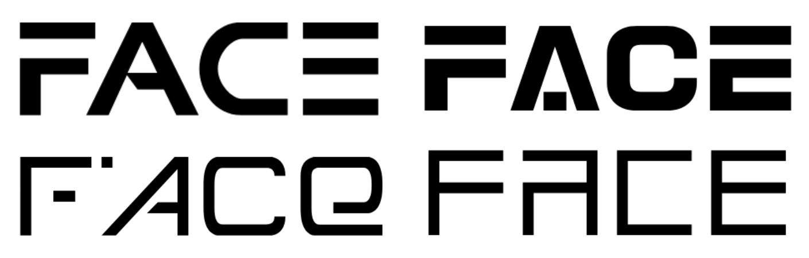

#### **What’s the first thing that springs to mind when you think ‘high tech’ - is it the latest apple iPhone, your favourite computer, or an OLED TV?**

Now what springs to mind when you associate ‘high tech’ with a font? Technically you can’t physically have a high-tech font; however, the association between high tech and typography naturally creates a modern, futuristic design in your mind.

When you google high tech font, you are presented with many different typefaces, all containing many similarities. The main one being a sans serif typeface. Whilst serifs are usually considered old fashioned - sans serif fonts are a look to the future. As apple, Microsoft, Windows, and many other top name brands continue to align with the ever-changing world, they all currently hold a sans serif typeface - depicting the modernness of the product/design.

Not only do these fonts have no serifs, but they also have another peculiar similarity, many often neglect parts of each letter. Not only is the type smoothed, but by creating gaps in the type, it instantly causes viewers to believe it is futuristic. Despite this, it does not affect the legibility and if anything, makes it easier to read. This latest creation could be due to the inability in the past to create typefaces with specialist computers. Fonts can now include straight lines and are not restricted to handwritten, cursive styles. 

Below is an experiment; using the website ‘Fontspace’ which includes many different, obscure designs; There is a section labelled ‘high-tech fonts’.

Choosing a singular word, here is how a selection of these futuristic types compare. 

As you can see, each font has aspects removed; This idea is futuristic as it adapts to the idea that ‘less is more’. The design in the top left portrays the ‘E’ by simply using three bold lines. Despite this missing most of the letter – it is still recognisable to the modern eye. Our brains are often flooded with over-complex styles therefore they attempt to find the easiest interpretation. Because of the similarities presented in each, our brains can easily understand what the design is attempting to represent and mimic.

One of the most popular high-tech fonts is Proxima Nova. Proxima Nova was created in the United States in 2005 by Mark Siminson. According to Simonson, Proxima Nova is 'a sans-serif style font that lies between Future and Akzidenz-Grotesk.' It balances modern proportions and classic geometry. It is used by major brands like Spotify, Twitter and Buzzfeed. This is a logo font that is suitable for businesses that use a lot of social media or want a modern internet presecnce. Many fonts similar to Proxima Nova exist which is slowly turning the old into the new and futurising all the brands/fonts we are familiar with.

What will come next?