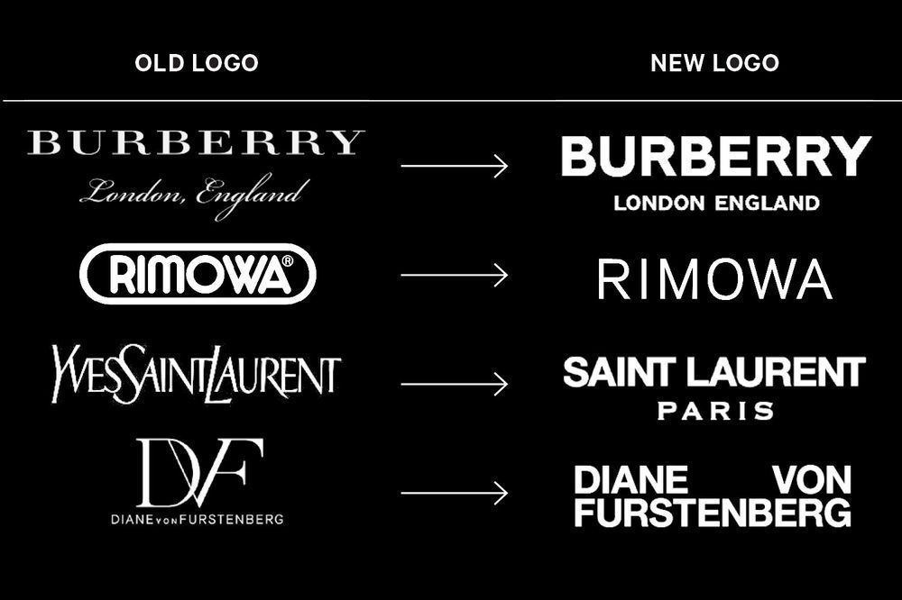
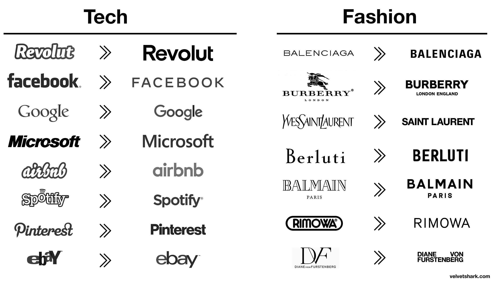

#### Why do simple graphic designs overweigh complex ones?

When you wake up in the morning, the chances are, the first thing you do is look at your smartphone, the TV, a book, the newspaper, or a digital alarm – all of which contain some form of typography. 

Yet, when our eyes are struggling to stay open and we stumble to the bathroom to brush our teeth, how much of the information we just read, sunk in?

After brushing your teeth, you get ready whilst probably watching the news or taking a call. When you eat breakfast, you continue to watch the news and even read the paper. You may be thinking, ‘I have no time in the morning to do all of this – I’m just rushing around’ – well, you would be surprised how much information your brain attempts to take in even know you may not be 100% focussed. Even when rushing around, you will still manage to check your phone to see the latest posts on facebook or even simply read the back of your cereal box without noticing. 

This is one of the primary reasons that simplicity in design has grown in popularity over the past few years. With such an overload of information in our day-to-day lives, we need designs that are easy to understand. When design is highly complicated, it becomes more and more specified for the viewer with every layer of complexity. So, while complex designs communicate their one message successfully, they usually don't allow for interpretation – meaning your brain is being restricted and therefore over-used. That’s why you tend not to read the tops and bottoms of your receipt or the instructions of how to switch on the TV – because, the chances are, the company does not want/need you to read them in the first place. They minimise the font size and make it so illegible so that you are more drawn to the logo, the brand and their latest offer.  Simple designs allow for multiple messages to be communicated. 

Common forms of simple typography include minimalistic designs which use clean lines, sharp edges and soft curves; conveying a clean and simple feel to the reader. This style is simply done using sans-serif or slab fonts. The goal of minimalist typography is to give you enough space to read and to truly comprehend what you're reading. If a brand can draw your attention with one heading in the morning, more so than the unnecessary information on the side of your fridge – they are succeeding.

Overall, Simplicity in design allows viewers to rest. If you are able to grasp your viewers’ attention and ensure they digest your information – you have successfully trapped your reader. Take a look at some examples of how famous brands have adapted to this new style of living over the years – I know which one I find more appealing – what about you?

