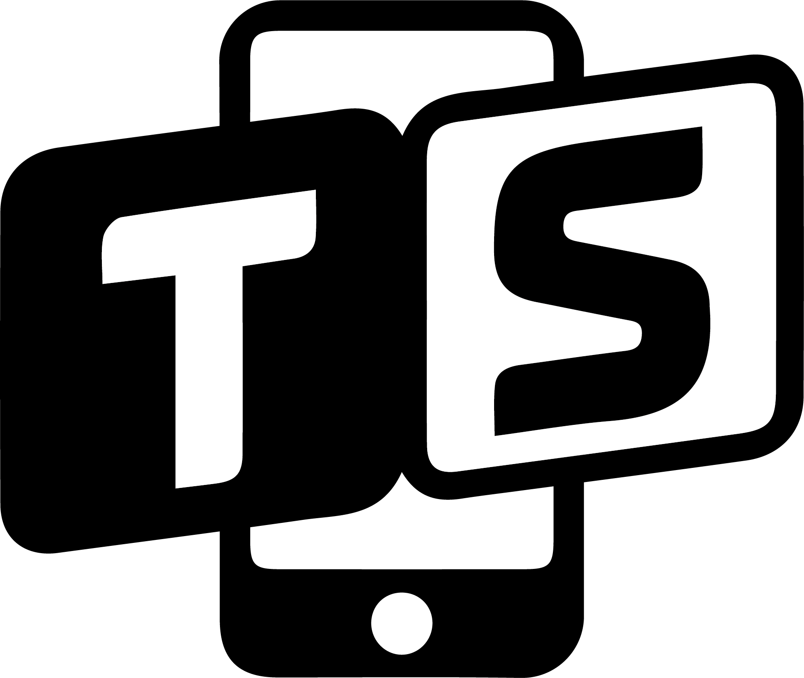

##### **The purpose of this blog is to explore the typographic choices of big technology brands and how they continue to stay up-to-date with modern generations. It also touches on the input this has into their success and overlooks failed company branding efforts into staying align with new-age media.**

###### **What made me choose 'TypeSmart'?**

'Type' demonstrates the exploration of typography whilst 'Smart' focuses on the technological emphasis. The smart also connotates the chosen brand’s ability to remain modern throughout the unpredictable changes.

###### **What Inspired the logo?**

When illustrating my brand, I pictured it to be a very modern, sleek design. This is because I wanted to emphasise my focus on the new generation. I believe my logo has captured this view whilst remaining simple yet effective. I originally started with just the ‘TS’ then recognised I wanted to illustrate the technological link. Therefore I added the smart phone silohette in the background as it is an ingenuous way of communicating the link of my blog to tech.

###### **What Inspired the homepage image?**

After discussing the theme of my brand, being technology, I wanted to focus the homepage on the most succesful technological brand worldwide, Apple. By choosing to centre Apple as the main focal point of the website, it automatically intrigues the mass population of those with apple products as well as computer whizz's who are fans of the brand. The chosen image showcases the welcome page shown when buying a new product, in several different languages. This does not only give those holding apple products a relatable image, but also captures the focus of the blog; font application and how chosen fonts must work with not just a singular language.